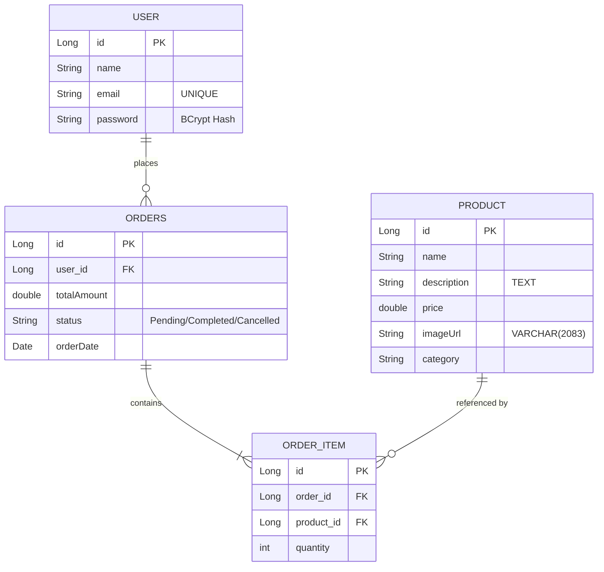

# Shoplane E-Commerce: Developer & Code Manual

This manual provides an in-depth explanation of the **Shoplane** E-commerce architecture, data flows, and a detailed code walkthrough for both the Spring Boot backend (`Ecomm`) and the vanilla HTML/CSS/JS frontend (`Ecomm-UI`).

---

## 1. Project Architecture Overview

Shoplane is built as a **decoupled client-server application**. The frontend is static and communicates with the backend REST API over HTTP.

```
+---------------------------------------+
|          Ecomm-UI (Frontend)          |
|  index.html | cart.html | login.html  |
+-------------------+-------------------+
                    |
            HTTP Requests (fetch)
                    |
                    v
+-------------------+-------------------+
|          Ecomm Backend (API)          |
|  Java 21 / Spring Boot 3.4.3          |
+-------------------+-------------------+
                    |
                Spring Data JPA
                    |
                    v
+-------------------+-------------------+
|            MySQL Database             |
|          Schema: "ecommerce"          |
+---------------------------------------+
```

### Key Architectural Layers:
1. **Frontend Client (`Ecomm-UI`)**: Manages presentation, client-side session (`localStorage` for cart and current user), search filters, dynamic modal structures, and custom toast alerts.
2. **REST Controllers (Backend)**: Expose endpoints (CORS-enabled via `@CrossOrigin("*")`) that parse payloads and return JSON responses with proper HTTP status codes.
3. **Service Layer**: Implements business rules (e.g., matching credentials using BCrypt, packaging shopping carts into orders, verifying product availability).
4. **Data Repositories**: Interfaces extending `JpaRepository` to abstract SQL generation.
5. **Database (MySQL)**: Contains the relational tables for `user`, `product`, `orders`, and `order_item`.

---

## 2. Database Schema & Relations

The database consists of 4 main tables:



---

## 3. Detailed Code Walkthrough

### 3.1 Backend: Utilities & Security

#### **[HashUtils.java](file:///D:/E-commerce/Ecomm/src/main/java/com/genie/Ecomm/util/HashUtils.java)**
Handles password encryption and matching using the BCrypt algorithm.

```java
package com.genie.Ecomm.util;

import org.mindrot.jbcrypt.BCrypt; // 1

public class HashUtils {

    /**
     * Hashes the input password using BCrypt with a secure salt.
     */
    public static String hashPassword(String password) {
        if (password == null) {
            return null; // 2
        }
        return BCrypt.hashpw(password, BCrypt.gensalt(12)); // 3
    }

    /**
     * Verifies a plaintext password against a stored BCrypt hash.
     */
    public static boolean checkPassword(String plaintextPassword, String hashedPassword) {
        if (plaintextPassword == null || hashedPassword == null) {
            return false; // 4
        }
        try {
            return BCrypt.checkpw(plaintextPassword, hashedPassword); // 5
        } catch (IllegalArgumentException e) {
            return false; // 6
        }
    }
}
```
**Explanation:**
1. **Importing jbcrypt**: Pulls in the library added to `pom.xml` to use BCrypt.
2. **Null Safety**: Prevents NullPointerExceptions if a user is created with a blank password field.
3. **gensalt(12)**: Generates a random salt with a work-factor (logarithmic rounds) of 12. This makes it extremely slow and costly for attackers to attempt brute-force dictionary attacks.
4. **Validation Check**: If either string is null, matching is automatically rejected.
5. **BCrypt.checkpw**: Extracts the salt from the stored `hashedPassword`, hashes the input `plaintextPassword` using that same salt, and compares the final results.
6. **Exception Catch**: If a legacy hash (e.g. SHA-256 or plaintext) exists in the database, `BCrypt` will throw an exception due to a format mismatch. Catching this ensures the app logs it out cleanly.

---

### 3.2 Backend: Authentication & User Service

#### **[UserService.java](file:///D:/E-commerce/Ecomm/src/main/java/com/genie/Ecomm/service/UserService.java)**
Performs user signup and password checks during login.

```java
public User registerUser(User user) {
    try {
        if (user.getPassword() != null) {
            user.setPassword(HashUtils.hashPassword(user.getPassword())); // 1
        }
        return userRepository.save(user); // 2
    } catch (Exception e) {
        e.printStackTrace();
    }
    return null; // 3
}
```
**Explanation:**
1. **Password Hashing**: Automatically encrypts the user's password using BCrypt before writing it to the database.
2. **save(user)**: Writes the record to MySQL. If the email is a duplicate, the database throws a unique key constraint violation exception.
3. **Catch Block**: Catches errors (like duplicate emails) and returns `null` to indicate registration failed.

```java
public User loginUser(String email, String password) {
    User user = userRepository.findByEmail(email); // 1
    if (user != null && password != null) {
        if (HashUtils.checkPassword(password, user.getPassword())) { // 2
            return user; // 3
        }
    }
    return null; // 4
}
```
**Explanation:**
1. **Find User**: Queries database for a user matching the email.
2. **BCrypt verification**: Calls `HashUtils.checkPassword` to verify the password.
3. **Success**: Returns the matched User object.
4. **Failure**: Returns `null` if credentials are wrong or the email is not found.

#### **[UserController.java](file:///D:/E-commerce/Ecomm/src/main/java/com/genie/Ecomm/controller/UserController.java)**
Exposes API endpoints to the frontend, mapping exceptions to HTTP error status codes.

```java
@PostMapping("/register")
public ResponseEntity<?> registerUser(@RequestBody User user) {
    User registered = userService.registerUser(user); // 1
    if (registered == null) {
        return ResponseEntity
            .status(HttpStatus.BAD_REQUEST) // 2
            .body(Map.of("error", "Registration failed. Email might already be registered.")); // 3
    }
    return ResponseEntity.ok(registered); // 4
}
```
**Explanation:**
1. **Register Request**: Calls `userService.registerUser` with the parsed user JSON request body.
2. **HttpStatus.BAD_REQUEST (400)**: If registration returns `null` (e.g. duplicate email), it responds with a 400 Bad Request status.
3. **Map.of(...)**: Wraps the error message in a JSON object format `{"error": "..."}` so the frontend can parse it.
4. **ResponseEntity.ok (200)**: On success, returns the User JSON object with an HTTP 200 code.

---

### 3.3 Backend: Order Processing

#### **[OrderService.java](file:///D:/E-commerce/Ecomm/src/main/java/com/genie/Ecomm/service/OrderService.java)**
Maintains transaction logic: places order details, links items, and queries histories.

```java
public OrderDTO placeOrder(Long userId, Map<Long, Integer> productQuantities, double totalAmount) {
    User user = userRepository.findById(userId)
             .orElseThrow(() -> new RuntimeException("User not found")); // 1

    Orders order = new Orders();
    order.setUser(user);
    order.setOrderDate(new Date());
    order.setStatus("Pending");
    order.setTotalAmount(totalAmount); // 2

    List<OrderItem> orderItems = new ArrayList<>();
    List<OrderItemDTO> orderItemDTOS = new ArrayList<>(); // 3

    for (Map.Entry<Long, Integer> entry : productQuantities.entrySet()) {
        Product product = productRepository.findById(entry.getKey())
                .orElseThrow(() -> new RuntimeException("Product Not found")); // 4

        OrderItem orderItem = new OrderItem();
        orderItem.setOrder(order);
        orderItem.setProduct(product);
        orderItem.setQuantity(entry.getValue()); // 5
        orderItems.add(orderItem);

        orderItemDTOS.add(new OrderItemDTO(product.getName(), product.getPrice(), entry.getValue())); // 6
    }

    order.setOrderItems(orderItems);
    Orders saveOrder = orderRepository.save(order); // 7
    return new OrderDTO(saveOrder.getId(), saveOrder.getTotalAmount(),
             saveOrder.getStatus(), saveOrder.getOrderDate(), orderItemDTOS); // 8
}
```
**Explanation:**
1. **Fetch User**: Looks up the user placing the order. Throws exception if user ID does not exist.
2. **Orders Setup**: Builds a new `Orders` record containing order date, pending status, and total checkout cost.
3. **Lists Initialization**: Prepares database entity lists (`OrderItem`) and clean Data Transfer Objects (`OrderItemDTO`).
4. **Product Lookup**: Iterates through the cart map. Finds the product details (price, name) by ID.
5. **Link Items**: Instantiates a new line item linking the product, the order reference, and the quantity.
6. **DTO Wrapping**: Populates a clean payload DTO with item name and price for the frontend display.
7. **save(order)**: Commits the parent order and cascades inserts to the `order_item` table.
8. **Return DTO**: Returns a formatted Order response.

---

## 4. Frontend Code Walkthrough

### 4.1 Client Catalog & Modals

#### **[api.js](file:///D:/E-commerce/Ecomm-UI/js/api.js)**
Fetches products, compiles cards, handles search, and renders details modals.

```javascript
let allProducts = []; // 1

async function loadProducts() {
    try {
        const response = await fetch(`${BASE_URL}/products`);
        allProducts = await response.json(); // 2
        renderProducts(allProducts); // 3
    } catch(error) {
        console.error("Error fetching products:", error);
        // Render offline message if server is down...
    }
}
```
**Explanation:**
1. **allProducts Global Cache**: Caches the list of products locally in memory so we can run instant searches without sending repeated backend requests.
2. **fetch()**: Invokes the backend REST API on `localhost:8080/products`.
3. **renderProducts**: Renders the fetched product cards onto the DOM.

```javascript
function handleSearch(query) {
    let filtered = allProducts.filter(product => 
        product.name.toLowerCase().includes(query.toLowerCase()) || 
        product.description.toLowerCase().includes(query.toLowerCase()) // 1
    );
    renderProducts(filtered); // 2
}
```
**Explanation:**
1. **Filtering**: Searches within names and descriptions for matches.
2. **Re-render**: Re-renders cards based on the filtered sub-array.

```javascript
function openProductDetailModal(id, name, price, imageUrl, description, category) {
    let modalEl = document.getElementById("productDetailModal");
    if (!modalEl) {
        modalEl = document.createElement("div");
        modalEl.id = "productDetailModal";
        modalEl.className = "modal fade";
        document.body.appendChild(modalEl); // 1
    }
    
    // Rating star generation...
    let ratingVal = ((id % 3) === 0) ? "4.8" : (((id % 2) === 0) ? "4.5" : "4.2"); // 2
    
    modalEl.innerHTML = `
        <div class="modal-dialog modal-lg modal-dialog-centered">
            <div class="modal-content text-white border-secondary" style="background-color: #1e1e1e;">
                ...
                <button class="btn btn-primary w-100 py-2.5"
                onclick="addToCart(${id}, '${name.replace(/'/g, "\\'")}', ${price}, '${imageUrl}'); bootstrap.Modal.getInstance(document.getElementById('productDetailModal')).hide();">
                    <i class="fas fa-shopping-cart me-2"></i> Add to Cart
                </button>
            </div>
        </div>
    `; // 3
    
    let bsModal = new bootstrap.Modal(modalEl);
    bsModal.show(); // 4
}
```
**Explanation:**
1. **Dynamic Modal Element**: Creates a Bootstrap modal container dynamically if not already present in the DOM.
2. **Deterministic Ratings**: Calculates dummy ratings based on ID to simulate ratings without hardcoding database values.
3. **Escaped Names**: Safe replacement of string single quotes (`.replace(/'/g, "\\'")`) to prevent JavaScript breaking on product names containing single quotes.
4. **Bootstrap JS API**: Instantiates the modal class using Bootstrap 5 and launches it.

---

### 4.2 Cart, Toasts, & Orders History

#### **[cart.js](file:///D:/E-commerce/Ecomm-UI/js/cart.js)**
Manages checkout, local storage sync, custom toasts, and order history fetches.

```javascript
function addToCart(id, name, price, imageUrl) {
    let cart = JSON.parse(localStorage.getItem("cart")) || []; // 1

    price = parseFloat(price);
    let itemIndex = cart.findIndex((item) => item.id === id); // 2
    if (itemIndex !== -1) {
        cart[itemIndex].quantity += 1; // 3
    } else {
        cart.push({ id, name, price, imageUrl, quantity: 1 }); // 4
    }
    localStorage.setItem("cart", JSON.stringify(cart)); // 5
    updateCartCounter();
    showToast(`${name} added to cart successfully!`, 'success'); // 6
}
```
**Explanation:**
1. **Read Local Storage**: Loads the existing cart array from browser storage.
2. **findIndex**: Checks if the item already exists in the cart.
3. **Increment**: Increments quantity if item exists.
4. **Push**: Appends a new item structure to the array if it's not already in the cart.
5. **Write Sync**: Serializes the updated cart array back to `localStorage`.
6. **Toast Alert**: Displays a beautiful custom success toast message.

```javascript
function showToast(message, type = 'success') {
    let container = document.getElementById("toast-container");
    if (!container) {
        container = document.createElement("div");
        container.id = "toast-container";
        container.className = "position-fixed bottom-0 end-0 p-3";
        container.style.zIndex = "1100";
        document.body.appendChild(container); // 1
    }
    
    let toast = document.createElement("div");
    toast.className = `toast align-items-center text-white bg-${type === 'success' ? 'success' : 'danger'} border-0 show mb-2 shadow-lg`; // 2
    toast.innerHTML = `
        <div class="d-flex p-2">
            <div class="toast-body fw-semibold d-flex align-items-center">
                <i class="fas ${type === 'success' ? 'fa-check-circle' : 'fa-exclamation-circle'} me-2"></i>
                ${message}
            </div>
            <button type="button" class="btn-close btn-close-white me-2 m-auto" data-bs-dismiss="toast"></button>
        </div>
    `;
    container.appendChild(toast);
    
    setTimeout(() => {
        toast.classList.remove("show"); // 3
        setTimeout(() => toast.remove(), 300); // 4
    }, 3000);
}
```
**Explanation:**
1. **Dynamic Toast Box**: Instantiates a toast container at the bottom-right corner of the page.
2. **Type Styling**: Colors the alert green (`bg-success`) or red (`bg-danger`) with descriptive FontAwesome icons.
3. **Slide Out**: Fades out the toast after 3 seconds.
4. **Garbage Collection**: Safely removes the element from the DOM after the animation completes to prevent DOM bloat.

---

### 4.3 Styling & Responsive Design

#### **[styles.css](file:///D:/E-commerce/Ecomm-UI/css/styles.css)**
Defines colors, dimensions, smooth transitions, card sizing, and animations.

```css
html {
  scroll-behavior: smooth; /* 1 */
}

.card {
  transition: all 0.3s ease-in-out; /* 2 */
  border: none;
  border-radius: 10px;
  background: var(--secondary-color);
  box-shadow: 0px 4px 8px rgba(255, 102, 0, 0.2);
}

.card:hover {
  transform: scale(1.05); /* 3 */
  box-shadow: 0px 10px 15px rgba(255, 102, 0, 0.3); /* 4 */
}

.card-img-top {
  transition: transform 0.3s ease-in-out;
  width: 100%;
  height: 250px;
  object-fit: cover; /* 5 */
}
```
**Explanation:**
1. **scroll-behavior: smooth**: Tells the browser to transition page movements smoothly when matching target anchor tags (e.g. scrolling when clicking "Shop Now" buttons).
2. **Transition**: Enables smooth animations on element changes (size, colors, shadow).
3. **transform: scale(1.05)**: Magnifies the card slightly on hover.
4. **Shadow Shift**: Expands the bright orange card shadow on hover for elevation feedback.
5. **object-fit: cover**: Tells the browser to crop the image uniformly to fit the `250px` container without stretching or showing borders.
