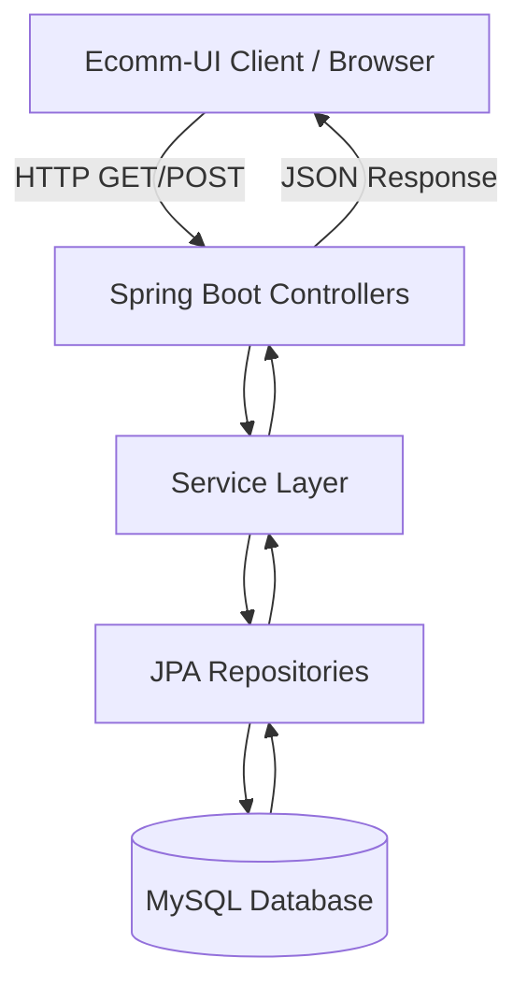
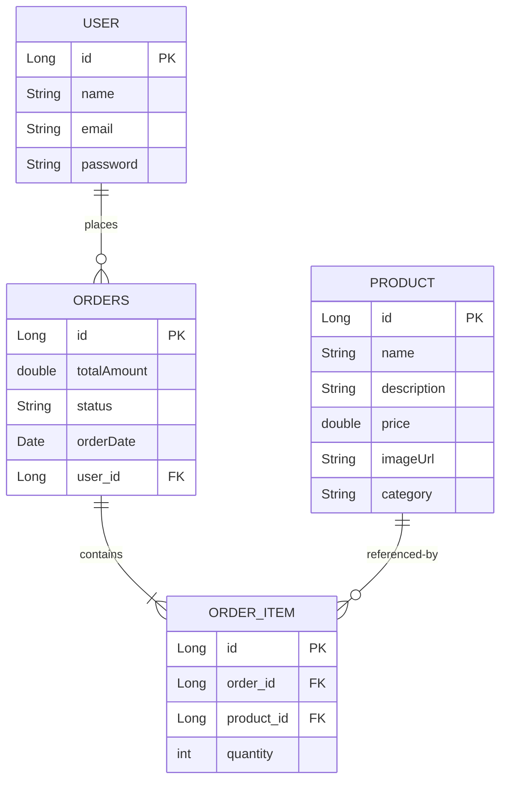

# Shoplane & Ecomm: Project Overview & Architecture Report

This document provides a comprehensive overview of the **Shoplane** E-commerce project, describing its architecture, data models, feature flows, and a gap analysis of missing or incomplete functionality.

---

## 1. Project Directory Structure

The repository is structured into two main components: a Spring Boot backend (`Ecomm`) and a vanilla HTML/CSS/JS frontend (`Ecomm-UI`).

```
E-commerce/
├── Ecomm/                     # Spring Boot Java Backend
│   ├── src/main/java/com/lakshyakumrawat/Ecomm/
│   │   ├── controller/        # REST APIs (User, Product, Order)
│   │   ├── dto/               # Data Transfer Objects (OrderDTO, OrderItemDTO)
│   │   ├── model/             # JPA Entities & Request Objects (User, Product, Orders, OrderItem, OrderRequest)
│   │   ├── repo/              # Spring Data JPA Repositories
│   │   └── service/           # Business Logic Layer
│   ├── src/main/resources/
│   │   └── application.properties # Database connection & JPA configurations
│   ├── pom.xml                # Maven Dependencies (Spring Boot, JPA, MySQL)
│   └── mvnw / mvnw.cmd        # Maven Wrapper scripts
│
└── Ecomm-UI/                  # Vanilla Web Frontend
    ├── css/
    │   └── styles.css         # Styling for index.html & cart.html
    ├── img/                   # Static product & banner images
    ├── js/
    │   ├── api.js             # Handles backend integration (fetching products)
    │   └── cart.js            # Handles client-side shopping cart storage
    ├── index.html             # Storefront Homepage
    └── cart.html              # Shopping Cart View
```

---

## 2. Technology Stack

### Backend (`Ecomm`)
*   **Java 21**
*   **Spring Boot 3.4.3**
    *   *Spring Web*: For exposing REST APIs.
    *   *Spring Data JPA*: ORM layer for database interactions.
*   **MySQL Database**: Relational database engine.
*   **Maven**: Build automation and dependency management tool.

### Frontend (`Ecomm-UI`)
*   **HTML5 & CSS3**: Core webpage structure and layout.
*   **JavaScript (ES6)**: Dynamic DOM manipulation and API communication.
*   **Bootstrap 5**: CSS framework for responsive layout grids and components.
*   **FontAwesome 6**: Icon library.

---

## 3. Architecture & Data Flow

The project follows a classic **Client-Server Architecture** with a decoupled database layer.



### Flow Breakdown:
1.  **Client Request**: The frontend makes HTTP calls (using Javascript `fetch`) to the backend API (`http://localhost:8080`).
2.  **Controller Layer**: Receives the requests, handles CORS permissions (via `@CrossOrigin("*")`), parses JSON payloads, and directs execution to the service layer.
3.  **Service Layer**: Implements business rules (e.g., matching users, calculating order items, checking product existence).
4.  **Repository Layer**: Uses Spring Data JPA interfaces to query the database.
5.  **Database**: Holds tables for `User`, `Product`, `Orders`, and `OrderItem`.

---

## 4. Database Schema (JPA Entities)

The backend defines four main entities mapped to the MySQL database:



*   **User & Orders**: One-to-Many relationship. A user can place multiple orders.
*   **Orders & OrderItem**: One-to-Many relationship. An order contains multiple line items.
*   **Product & OrderItem**: Many-to-One relationship. Each order line item points to a specific product.

---

## 5. Core Feature Flows

### A. Product Catalog & Discovery Flow
1.  **Trigger**: User loads `index.html`.
2.  **API Call**: `index.html` invokes `loadProducts()` in [api.js](file:///D:/E-commerce/Ecomm-UI/js/api.js).
3.  **Endpoint**: `GET http://localhost:8080/products` queries `ProductController::getAllProducts()`.
4.  **Database Query**: `ProductRepository::findAll()` fetches all products.
5.  **Categorization (Frontend)**: Products are parsed by category:
    *   `Clothing` -> Rendered inside the *Clothing Collection* container.
    *   `Electronics` -> Rendered inside the *Electronics & Gadgets* container.
    *   Others -> Rendered inside the *Trending Products* container.

### B. Cart Management Flow
1.  **Trigger**: User clicks "Add to Cart" on a product card.
2.  **Logic**: `cart.js::addToCart()` updates an array stored in the browser's `localStorage` (`cart`).
3.  **Update**: Navbar cart badge counter is updated.
4.  **Cart View**: On `cart.html`, `cart.js::loadCart()` parses `localStorage` to construct a table listing the product name, price, quantity, and subtotal.
5.  **Modification**: User can adjust the quantity (+/-) or remove the item entirely via `changeQuantity()`, which syncs back to `localStorage`.

### C. Authentication Flow
*   **Backend Capabilities**:
    *   `POST /users/register`: Registers a user by hashing or saving their credentials directly.
    *   `POST /users/login`: Authenticates a user by matching email and password.
*   **Frontend State**: *Missing implementation.* There is currently no UI layout (login or registration page) to allow users to sign in.

---

## 6. Gap Analysis & Architecture Review

While the project has a solid framework, there are critical gaps and architectural weaknesses that should be resolved to make the application production-ready:

| Area | Issue Description | Severity | Recommendation |
| :--- | :--- | :--- | :--- |
| **Broken Checkout Flow** | The "Proceed To Payment" button on `cart.html` calls `checkout()`, which is **not implemented** in [cart.js](file:///D:/E-commerce/Ecomm-UI/js/cart.js). Orders cannot be placed from the frontend. | **Critical** | Implement `checkout()` in `cart.js` to serialize the cart, get the active user ID, and send a `POST` request to `/orders/place/{userId}`. |
| **Missing User Session** | The frontend has no registration, login page, or session management (`localStorage` / cookies) to store a logged-in user. The backend requires a `userId` to place orders. | **High** | Create sign-up/login pages. Store the logged-in user ID/profile in `localStorage` upon success. |
| **Plaintext Password Storage** | User passwords are saved and compared in **plaintext** (`user.getPassword().equals(password)`) inside [UserService.java](file:///D:/E-commerce/Ecomm/src/main/java/com/lakshyakumrawat/Ecomm/service/UserService.java). | **High** | Introduce a password hashing library (e.g., BCrypt via Spring Security) before saving/verifying credentials. |
| **Permissive CORS** | Backend controllers use `@CrossOrigin("*")` which exposes the application to security vulnerabilities like CSRF. | **Medium** | Restrict the allowed CORS origin to specific origins (e.g., `http://localhost:5500` or wherever the frontend runs). |
| **Lack of Exception Handling** | If a product or user is not found, the service throws a `RuntimeException`, causing a generic 500 error response without user-friendly messages. | **Medium** | Create a `@ControllerAdvice` global exception handler to map exceptions to proper HTTP status codes and payloads. |
| **Static Images Path** | The homepage banners and products point to `img/img1.png`, etc., which must exist locally on the frontend server. | **Low** | Ensure image files exist or integrate an image hosting service / mock URLs. |

---

## 7. Next Steps for Development

To complete the end-to-end integration:
1.  **Frontend Auth Pages**: Create a login and register page that communicates with `/users/login` and `/users/register`.
2.  **Checkout Implementation**: Implement the `checkout()` function in `cart.js` using the saved user ID.
3.  **Seed Products**: Ensure the database is populated with initial products using an import script or backend endpoint.
